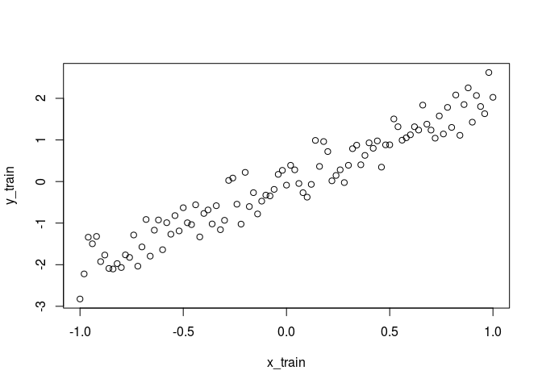
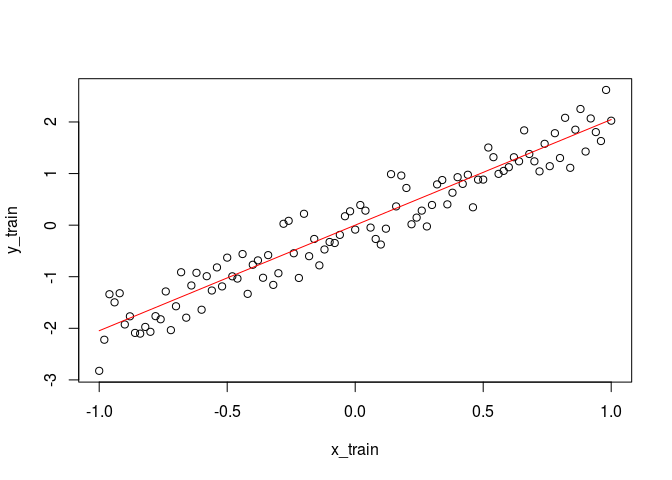

Ch 03: Concept 01
================

Linear regression
=================

Import TensorFlow for the learning algorithm. We'll need NumPy to set up the initial data. And we'll use matplotlib to visualize our data.

``` r
library(tensorflow)
```

Define some constants used by the learning algorithm. There are called hyper-parameters.

``` r
learning_rate <- 0.01
training_epochs <- 100
```

Set up fake data that we will use to to find a best fit line

``` r
x_train <- seq.int(-1, 1, length.out = 101)
y_train <- 2 * x_train + rnorm(length(x_train), mean = 0, sd=1) * 0.33
```

Plot the raw data

``` r
plot(x_train, y_train)
```



Set up the input and output nodes as placeholders since the value will be injected by x\_train and y\_train.

``` r
X <- tf$placeholder("float")
Y <- tf$placeholder("float")
```

Define the model as y = w'\*x

``` r
model <- function(X, w){
    return(tf$multiply(X, w))
}
```

Set up the weights variable

``` r
w <- tf$Variable(0.0, name="weights")
```

Define the cost function as the mean squared error

``` r
y_model <- model(X, w)
cost <- tf$reduce_mean(tf$square(Y-y_model))
```

Define the operation that will be called on each iteration of the learning algorithm

``` r
train_op <- tf$train$GradientDescentOptimizer(learning_rate)$minimize(cost)
```

Initialize all variables

``` r
sess = tf$Session()
init = tf$global_variables_initializer()
sess$run(init)
```

Train on each (x, y) pair multiple times

``` r
for(epoch in 1:training_epochs){
    for(i in 1:length(x_train)){
        sess$run(train_op, feed_dict=dict(X=x_train[i], Y= y_train[i]))
    }
}
```

Fetch the value of the learned parameter

``` r
w_val <- sess$run(w)
sess$close()
```

Visualize the best fit curve

``` r
plot(x_train, y_train)
y_learned <- x_train*w_val
lines(x_train, y_learned, col='red')
```


