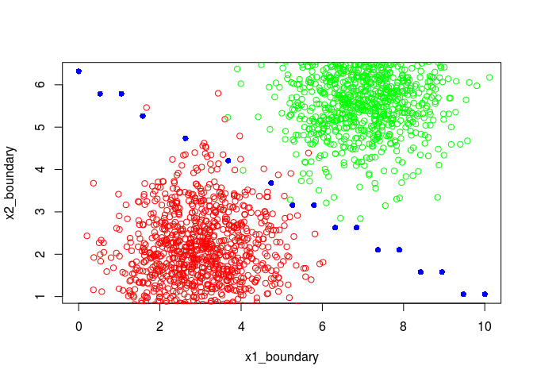

Ch 04: Concept 03
================

Logistic regression in higher dimensions
========================================

Set up the imports and hyper-parameters

``` r
library(tensorflow)

learning_rate <- 0.1
training_epochs <- 2000
```

Define positive and negative to classify 2D data points:

``` r
x1_label1 <- rnorm(1000, 3, 1) 
x2_label1 <- rnorm(1000, 2, 1)
x1_label2 <- rnorm(1000, 7, 1)
x2_label2 <- rnorm(1000, 6, 1)
x1s <- c(x1_label1, x1_label2)
x2s <- c(x2_label1, x2_label2)

ys <- c(rep(0, length(x1_label1)), rep(1, length(x1_label2)))
```

define placeholders, variables, model, and the training op:

``` r
X1 <- tf$placeholder(tf$float32, shape=NULL, name="x1")
X2 <- tf$placeholder(tf$float32, shape=NULL, name="x2")
Y <- tf$placeholder(tf$float32, shape=NULL, name="y")
w <- tf$Variable(c(0., 0., 0.), name="w", trainable=TRUE)

y_model <- tf$sigmoid(-(w[2] * X2 + w[1] * X1 + w[0]))
cost <- tf$reduce_mean(-tf$log(y_model * Y + (1 - y_model) * (1 - Y)))
train_op <- tf$train$GradientDescentOptimizer(learning_rate)$minimize(cost)
```

Train the model on the data in a session:

``` r
with(tf$Session() %as% sess,{
    sess$run(tf$global_variables_initializer())
    prev_err <- 0
    for(epoch in 1:training_epochs){
        err_ = sess$run(list(cost, train_op), dict(X1= x1s, X2= x2s, Y= ys))
        if(epoch %% 100 == 0)
            print(paste(epoch, err_[[1]]))
        if(abs(prev_err - err_[[1]]) < 0.0001)
            break
        prev_err <- err_[[1]]
    }
    w_val <- sess$run(w, dict(X1= x1s, X2= x2s, Y= ys))
})
```

    ## [1] "100 0.370952367782593"
    ## [1] "200 0.270847350358963"
    ## [1] "300 0.213927298784256"
    ## [1] "400 0.177796065807343"
    ## [1] "500 0.152981922030449"
    ## [1] "600 0.134917855262756"
    ## [1] "700 0.121177360415459"

Here's one hacky, but simple, way to figure out the decision boundary of the classifier:

``` r
x1_boundary <- c()
x2_boundary <- c()
with(tf$Session() %as% sess,{
    for(x1_test in seq.int(0,10,length.out = 20)){
        for(x2_test in seq.int(0,10,length.out = 20)){
            z <- sess$run(tf$sigmoid(-x2_test*w_val[3] - x1_test*w_val[2] - w_val[1]))
            if(abs(z - 0.5) < 0.05){
                x1_boundary <- c(x1_boundary, x1_test)
                x2_boundary <- c(x2_boundary, x2_test)
            }
        }
    }
})
```

Ok, enough code. Let's see some a pretty plot:

``` r
plot(x1_boundary, x2_boundary, col='blue', pch=16)
points(x1_label1, x2_label1, col='red')
points(x1_label2, x2_label2, col='green')
```


