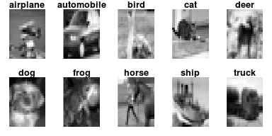

Ch 09: Concept 01
================

Using the CIFAR-10 dataset
==========================

Download the CIFAR-10 dataset for Python here <https://www.cs.toronto.edu/~kriz/cifar.html>.

The documentation comes with the following helper function:

``` r
library(reticulate)

pickle <- import('cPickle')
py <- import_builtins()


unpickle <- function(file){
    fo <- py$open(file, 'rb')
    dict <- pickle$load(fo)
    fo$close()
    return(dict)
}
```

Each image is a flat vector of colored pixel values. We'll convert it to a matrix of pixels instead to make it easer to reason about the image.

First, let's grayscale the image so that we can deal with a more natural representation.

Then, we'll crop the edges of the image away to further similify the number of dimensions in the input data.

Finally, we'll normalize the input by subtracting the mean pixel intensity and dividing by the standard deviation.

``` r
clean <- function(data){
  imgs <- aperm(array(t(data), dim = c(32, 32,3,nrow(data))), perm=c(4,3,2,1))
  grayscale_imgs <- apply(imgs, c(1,3,4), mean)
  cropped_imgs <-  grayscale_imgs[,5:28, 5:28]
  means <- apply(cropped_imgs, c(2,3), mean)
  stds <- apply(cropped_imgs, c(2,3), sd)
  normalized <- apply(cropped_imgs, c(1), function(img){res <- (img - means)/stds})
  return(t(apply(normalized, 2,rev)))
}
```

Here's a helper function to load and clean all the images:

``` r
read_data <- function(directory){
  names <- unpickle(paste0(directory,"/","batches.meta"))$label_names
  
  filenames <- list.files("cifar-10-batches-py",pattern = "data_batch",full.names = T)
  batch_data <- lapply(filenames, unpickle)
  
  data_list <- lapply(batch_data, function(x){
    x$data
    })
  data <- do.call(rbind, data_list)
  
  labels_list <- lapply(batch_data, function(x){
    x$labels
    })
  labels <- do.call(c, labels_list)
  
  cat(dim(data),", ", length(labels))
  
  data <- clean(data)
  return(list(names=names, data=data, labels=labels))
}
```

Let's display some images from the dataset:

``` r
name_data_labels <- read_data("cifar-10-batches-py")
```

    ## 50000 3072 ,  50000

``` r
set.seed(7874)
par(mfrow=c(2,5), mar = rep(1, 4))
for(i in 0:9){
  idx <- sample(which(name_data_labels$labels == i), 1)
  image(matrix(name_data_labels$data[idx,], byrow=T , nrow=24), 
      axes = FALSE, col = grey(seq(0, 1, length = 256)), main=name_data_labels$names[i+1])
  
}
```


