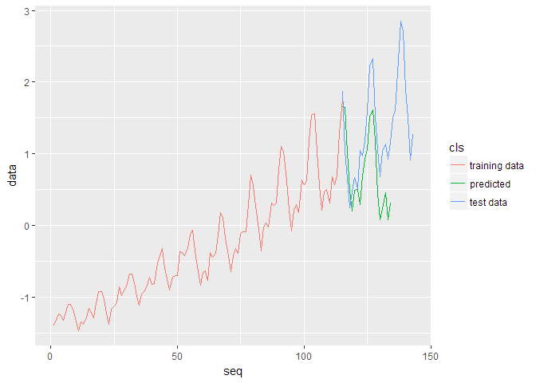

Ch 10: Concept 03
================

Recurrent Neural Network on real data
=====================================

``` r
library(tensorflow)
library(ggplot2)

SeriesPredictor <- setRefClass("SeriesPredictor",
    fields=c('input_dim', 'seq_size', 'hidden_dim', 'W_out', 'b_out',
             'x','y', 'cost', 'train_op', 'saver'),
    methods=list(
      initialize=function(input_dim, seq_size, hidden_dim=10){
        # Hyperparameters
        .self$input_dim <- as.integer(input_dim)
        .self$seq_size <- as.integer(seq_size)
        .self$hidden_dim <- as.integer(hidden_dim)
        
        # Weight variables and input placeholders
        .self$W_out <- tf$Variable(tf$random_normal(list(.self$hidden_dim, 1L)), name='W_out')
        .self$b_out <- tf$Variable(tf$random_normal(list(1L)), name='b_out')
        .self$x <- tf$placeholder(dtype=tf$float32, shape=list(NULL, .self$seq_size, .self$input_dim ))
        .self$y <- tf$placeholder(dtype=tf$float32, shape=list(NULL, .self$seq_size))
        
        # Cost optimizer
        .self$cost <- tf$reduce_mean(tf$square(model() - .self$y))
        .self$train_op <- tf$train$AdamOptimizer(learning_rate=0.01)$minimize(.self$cost)

        # Auxiliary ops
        .self$saver = tf$train$Saver()
      },
      model=function(){
        #:param x: inputs of size [T, batch_size, input_size]
        #:param W: matrix of fully-connected output layer weights
        #:param b: vector of fully-connected output layer biases
        cell <- tf$contrib$rnn$BasicLSTMCell(.self$hidden_dim)
        outputs_states <- tf$nn$dynamic_rnn(cell, .self$x, dtype=tf$float32)
        
        #not num_examples <- tf$shape(.self$x)[1]
        num_examples <- tf$shape(.self$x)[0]
        #expend : 10,1 -> 1,10,1 
        #tile : 1,10,1 -> 3,10,1
        W_repeated <- tf$tile(tf$expand_dims(.self$W_out, 0L), list(num_examples, 1L, 1L)) 
        #3,4,10 x 3,10,1
        out <- tf$matmul(outputs_states[[1]], W_repeated) + .self$b_out
        out <- tf$squeeze(out)
        return(out)
      },
      train=function(train_x, train_y, test_x, test_y){
        with(tf$Session() %as% sess, {
          tf$get_variable_scope()$reuse_variables()
          sess$run(tf$global_variables_initializer())
          max_patience <- 3
          patience <- max_patience
          min_test_err <- Inf
          step <- 0
          while(patience > 0){
            NULL_train_err <- sess$run(list(.self$train_op, .self$cost), 
                                       feed_dict=dict(x= train_x, y= train_y))
            train_err <- NULL_train_err[[2]]
            if(step %% 100 == 0){
              test_err <- sess$run(.self$cost, feed_dict=dict(x= test_x, y= test_y))
              cat(sprintf('step: %d\t\ttrain err: %f\t\ttest err: %f\n',step, train_err, test_err))
              if(test_err < min_test_err){
                min_test_err <- test_err
                patience <- max_patience
              }else{
                patience <- patience - 1
              }
            }
            step <- step + 1
          }
          save_path <- .self$saver$save(sess, './model.ckpt')
          print(sprintf('Model saved to %s',save_path))
        })
      }, 
      test=function(sess, test_x){
        tf$get_variable_scope()$reuse_variables()
        .self$saver$restore(sess, './model.ckpt')
        output <- sess$run(model(), feed_dict=dict(x=test_x))
        return(output)
      }
    )
)
```

``` r
plot_results <- function(train_x, predictions, actual){
  time_series_data <- rbind(
    data.frame(seq=1:length(train_x), data=train_x, cls='training data'),
    data.frame(seq=length(train_x):(length(train_x) + length(predictions) - 1),
               data=predictions, cls='predicted'),
    data.frame(seq=length(train_x):(length(train_x) + length(actual) - 1), 
               data=actual, cls='test data'))
  
  
  print(ggplot(time_series_data, aes(seq, data)) + geom_line(aes(colour=cls)))
}
```

``` r
source("Concept01_timeseries_data.R")

seq_size <- 5L
predictor <- SeriesPredictor$new(input_dim=1L, seq_size=seq_size, hidden_dim=100L)
data <- load_series('international-airline-passengers.csv')
train_data_actual_vals <- split_data(data)
train_data  <- train_data_actual_vals[[1]]
actual_vals <- train_data_actual_vals[[2]]


train_x <- c()
train_y <- c()
for(i in 1:(length(train_data) - seq_size)){
  train_x <- c(train_x, train_data[i:(i+seq_size - 1)])
  train_y <- c(train_y, train_data[(i+1):(i+seq_size)])
}
train_x <- aperm(array(train_x,dim=c(5,i,1)),c(2,1,3))
train_y <- matrix(train_y, ncol=5 , byrow=T)

test_x <- c() 
test_y <- c()
for(i in 1:(length(actual_vals) - seq_size)){
  test_x <- c(test_x, actual_vals[i:(i+seq_size - 1)])
  test_y <- c(test_y, actual_vals[(i+1):(i+seq_size)])
}

test_x <- aperm(array(test_x,dim=c(5,i,1)),c(2,1,3))
test_y <- matrix(test_y, ncol=5 , byrow=T)


predictor$train(train_x, train_y, test_x, test_y)
```

    ## step: 0      train err: 0.763628     test err: 1.973412
    ## step: 100        train err: 0.041158     test err: 0.303015
    ## step: 200        train err: 0.038779     test err: 0.340862
    ## step: 300        train err: 0.035553     test err: 0.350543
    ## step: 400        train err: 0.033465     test err: 0.325148
    ## [1] "Model saved to ./model.ckpt"

``` r
with(tf$Session() %as% sess, {
    predicted_vals <- predictor$test(sess, test_x)
    print(sprintf('predicted_vals, %s', dim(predicted_vals)))
    
    plot_results(train_data, predicted_vals[,1], actual_vals)
    
    prev_seq <- train_x[nrow(train_x),,]
    predicted_vals <- c()
    for(i in 1:20){
      next_seq <- predictor$test(sess, array(prev_seq, dim = c(1,5,1)))
      predicted_vals <- c(predicted_vals,next_seq[5])
      prev_seq <- c(prev_seq[2:5], next_seq[5])
    }
    plot_results(train_data, predicted_vals, actual_vals)
})
```

    ## [1] "predicted_vals, 24" "predicted_vals, 5"


